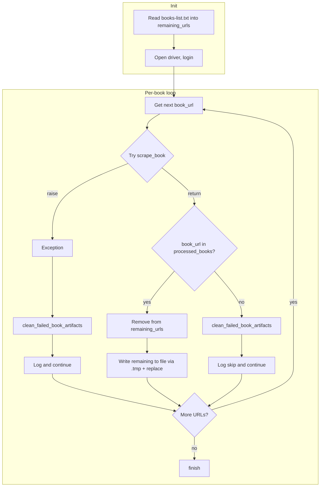

# Resilient batch run for `--books`

## Current behavior and risks

- `**[blinkistscraper/__main__.py](blinkistscraper/__main__.py)**` (lines 374–393): The `--books` branch opens the file once, iterates `readlines()`, and calls `scrape_book()` for each line. Any uncaught exception is handled by the top-level `except Exception` (lines 399–401), which logs and exits the whole process.
- **Success**: `scrape_book()` appends the URL to `processed_books` only when the full pipeline (scrape + optional audio + `generate_book_outputs`) completes. The list file is never updated.
- **Failure**: `scraper.scrape_book_data()` can return `(None, False)` (e.g. no book data, language mismatch); other failures (network, PDF generation, etc.) raise. A failure after `dump_book()` leaves a dump and possibly partial output under `books/`.

## Target behavior

| Outcome                                          | Action                                                                                                   |
| ------------------------------------------------ | -------------------------------------------------------------------------------------------------------- |
| Book completes fully                             | Remove that URL from `books-list.txt` and continue.                                                      |
| Book fails (exception or scraper returns `None`) | Do **not** remove URL; remove that book’s artifacts from `dump/` and `books/`; log and continue to next. |
| Process interrupted                              | Next run uses the updated list (only remaining URLs); same command continues.                            |

## Implementation

### 1. Add `clean_failed_book_artifacts(book_url)` in `__main__.py`

- **Purpose**: Remove all on-disk artifacts for a single book so the next run retries it from scratch.
- **Location**: Define inside `main()`, near the other helpers (e.g. after `finish`), so it can use `get_book_dump_filename` and `get_book_pretty_filepath` from `utils` (and `os`, `json`, `shutil`).
- **Logic**:
  - `dump_path = get_book_dump_filename(book_url)` (utils already supports URL: `"blinkist.com" in book_json_or_url` → `url.split("/")[-1] + ".json"`).
  - If `dump_path` exists: load JSON from it; compute `book_dir = get_book_pretty_filepath(book_json)`; call `shutil.rmtree(book_dir)` if the path is a directory (ignore `FileNotFoundError`/`OSError`); then `os.remove(dump_path)`.
  - If dump does not exist: do nothing (no `books/` output for this run).
- **Edge**: `get_book_pretty_filepath()` can return a Windows long-path prefix (`\\\\?\\...`); `shutil.rmtree` and `os.remove` are fine with it.

### 2. Rework the `--books` loop in `__main__.py` (lines 374–393)

- **Load list once**: Open `args.books`, read lines, and build `remaining_urls = [line.strip() for line in f if line.strip()]`. Skip empty lines. Close the file.
- **Iterate over `remaining_urls`**: For each `book_url`:
  - **Try**: Call `dump_exists = scrape_book(driver, processed_books, book_url, category={"label": args.book_category}, match_language=match_language)`.
  - **Except**: On `Exception`, log it (e.g. `log.exception(e)`), call `clean_failed_book_artifacts(book_url)`, then `continue`.
  - **After try/except (success path)**:
    - If `book_url` is in `processed_books`: remove `book_url` from `remaining_urls` (e.g. `remaining_urls = [u for u in remaining_urls if u != book_url]`), then write `remaining_urls` back to disk (see below). So progress is persisted after every successful book.
    - Else (scrape returned without appending, e.g. `book_json` was `None`): call `clean_failed_book_artifacts(book_url)`, log a short warning (e.g. "Book skipped or failed: {book_url}"), then continue.
  - **Cooldown**: If `not dump_exists`, `time.sleep(args.cooldown)` as today (only when scraping was performed).

### 3. Safe write of the books list

- When updating `args.books`, write to a temp file then atomically replace:
  - `tmp_path = args.books + ".tmp"`.
  - Open `tmp_path` for writing, write `"\n".join(remaining_urls)` and a trailing newline, close.
  - `os.replace(tmp_path, args.books)`.
- This avoids corrupting the list if the process dies mid-write.

### 4. Imports in `__main__.py`

- Add `import shutil` at the top (for `shutil.rmtree` in `clean_failed_book_artifacts`).
- Ensure `utils.get_book_dump_filename` is importable where cleanup runs (e.g. `from utils import ... get_book_dump_filename` in the same place as existing utils imports, or at top level).

### 5. Edge cases (handled by the above)

- **Empty lines**: Dropped when building `remaining_urls`; never written back.
- **Episode URLs** (e.g. `/reader/episode/446`): Slug is last path segment (`446`); `get_book_dump_filename(book_url)` yields `dump/446.json`; cleanup works without special case.
- **Non-book URLs** (e.g. category links): Will fail in scraper and return `(None, False)`; we treat as failure, cleanup (no-op if no dump), and continue.
- **KeyboardInterrupt**: Still caught at top level; the list was last written after the previous success, so re-run continues from the remaining list.

## Flow diagram

## Files to change

- `**[blinkistscraper/__main__.py](blinkistscraper/__main__.py)**` only:
  - Add `import shutil` and ensure `get_book_dump_filename` is imported from `utils` (e.g. in the existing `from utils import ...` used for `scraped_audio_exists` or at top level).
  - Add helper `clean_failed_book_artifacts(book_url)` (load dump if present, rmtree books dir, remove dump).
  - Replace the `elif args.books:` block: read file into `remaining_urls`, loop with try/except, on success remove from list and write via `.tmp` + `os.replace`, on failure call cleanup and continue.

No changes to `scraper.py`, `generator.py`, or `utils.py` beyond what is necessary for imports (only `__main__.py` needs `get_book_dump_filename` from utils; it already uses other utils helpers).

## Testing suggestions (manual)

- Run with a small list (e.g. 2–3 URLs), one of which is invalid or known to fail: confirm the failed entry is not removed and its artifacts (if any) are removed; the successful ones are removed from the list.
- Interrupt mid-run (Ctrl+C): confirm the list on disk has only the remaining URLs and re-running the same command continues from the next book.

